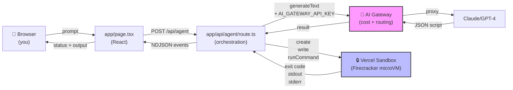
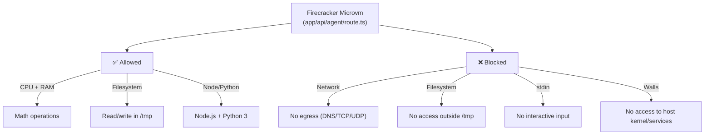
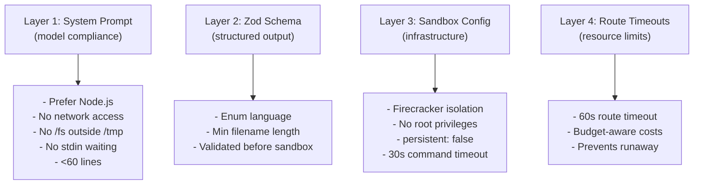

# sandbox-agent-demo

A focused demo of the **Vercel AI SDK** and **Sandbox**: describe a coding task, the model generates a self-contained script (Node.js or Python), and it runs isolated in a Firecracker microVM instead of on the request-handling server. Progress and output stream back to the browser as events.

**Free tier compatible** — works with zero-cost AI Gateway models. No billing required to try it.

Showcases:
- **AI SDK** code generation with free tier models via manual JSON parsing
- **Sandbox** infrastructure-level isolation and lifecycle management
- **Streaming events** with a custom NDJSON protocol (not SSE/useChat)
- **Production thinking** (cost awareness, tight timeouts, security model)

Built as a companion to [`trustclaw-jfrog-demo`](https://github.com/vhr1975/trustclaw-jfrog-demo) — same "generate → execute → report" pattern on different infrastructure.

## How It Works

A complete flow in under 60 seconds:

1. **You write a prompt** in the browser (e.g., "Generate 1000 random numbers and find the mean")
2. **Model generates code** — `generateText` with AI Gateway (free tier)
3. **Response parsed** — extract `{language, filename, code, summary}` from JSON
4. **Sandbox spins up** — Vercel launches a Firecracker microVM
5. **Script is written** → runs → output captured
6. **Results stream back** as NDJSON events (status → code → result → done)
7. **Browser renders** each event as it arrives

The entire flow is observable in your browser console. See `app/page.tsx` lines 47–65 for the event-parsing logic.

## Architecture Diagram



**Key components:**
- **AI Gateway** (magenta): Unified LLM API endpoint — handles auth, routing, cost tracking
- **Sandbox** (blue): Isolated microVM for executing untrusted scripts

## Event Streaming (NDJSON)


## Isolation Model

What the sandbox **allows** vs. **blocks**:



## The Two Critical Vercel Pieces

### 1. AI Gateway: Why Route Through It?

**What it is:** A unified API proxy that sits between your app and model providers (Claude, GPT-4, etc.).

**Why use it instead of calling Claude/OpenAI directly:**
- **Cost optimization** — batches requests, handles retries, picks cheapest models per task
- **Rate limiting & quotas** — free tier (10 requests/day), scales to Hobby/Pro
- **Unified token management** — one `AI_GATEWAY_API_KEY` works across providers
- **Model routing** — can swap models without code changes (`AI_MODEL` env var)
- **Observability** — logs all requests in Vercel dashboard for cost tracking

**How this app uses it:**
- Route calls `generateText({ model: process.env.AI_MODEL ?? "inclusionai/ling-3.0-flash-free" })`
- The token in `.env.local` / production env vars is the gateway key
- All LLM calls flow through AI Gateway, not directly to Claude/OpenAI APIs

### 2. Sandbox: Why Isolate Script Execution?

**The problem it solves:**
Without the Sandbox, running arbitrary user-generated code would execute **on your server**:
```
User prompt → Model generates script → script runs on your Node.js process
```
Risk: Malicious prompt → malicious script → compromised server (network access, env var theft, filesystem damage).

**The Sandbox solution:**
```
User prompt → Model generates script → script runs in isolated Firecracker microVM
```

**Why that matters:**
- **Resource isolation** — runaway script (infinite loop) is contained; can't crash the main server
- **Filesystem isolation** — generated script can't read `/etc/passwd` or your source code
- **Network isolation** — script can't reach internal services, steal API keys, or exfil data
- **Lifecycle management** — Vercel automatically provisions and tears down the microVM (no cleanup overhead)

**How this app uses it:**
- `app/api/agent/route.ts` line 80–84: `Sandbox.create({ runtime: "node24", timeout: 30_000, persistent: false })`
- Writes the generated script to the sandbox's `/tmp`
- Runs it: `sandbox.runCommand({ cmd: "node", args: ["script.js"] })`
- Captures stdout/stderr and kills the VM when done

This is the key difference from trustclaw: trustclaw runs code on a separate serverless function (isolation via request boundary); sandbox runs it in a true microVM (Firecracker), which is stronger isolation.

## Why Manual JSON Parsing (Not generateObject)

`generateObject` requires expensive structured-output models (GPT-4, Claude Opus). Since this demo runs on the **free tier**, we use `generateText` instead and parse the JSON manually:

- **Model** generates plain JSON via system prompt
- **Route** parses with `JSON.parse()`, validates with Zod
- **Trade-off**: Simpler mental model (one code path), works on free tier — but requires trusting the model to return valid JSON (it usually does; errors are caught and streamed back as error events)

## Setup (Zero-Cost Local Development)

**Prerequisites:** Node 20+, npm. No credit card required.

```bash
npm install
cp .env.example .env.local
```

**Step 1: Get AI Gateway key (free tier)**
1. Sign up for free at https://vercel.com (no card)
2. Go to https://vercel.com/dashboard/ai-gateway
3. Click **Create Token**
4. Copy and paste into `.env.local`:
   ```bash
   AI_GATEWAY_API_KEY=<your_free_token>
   ```
   Rate limit: 10 requests/day (free tier). Perfect for local testing.

**Step 2: Link repo to Vercel (for Sandbox auth)**
```bash
npm install -g vercel  # one-time global install
vercel link            # link this repo to a Vercel project (interactive)
vercel env pull        # pull OIDC credentials into .env.local
```

**Step 3: Start dev server**
```bash
npm run dev
```

Open http://localhost:3000, type a prompt, and watch it generate and execute code — all running locally with **zero cost**.

**OIDC token validity:** The token expires after 12 hours. If it expires, just re-run `vercel env pull` to get a fresh one.

**Production deployment:** This is where Sandbox costs kick in (see Cost Breakdown section above). For local-only testing, you're completely free.

## Deploying

```bash
vercel deploy
```

Then set `AI_GATEWAY_API_KEY` in your Vercel project environment variables:
1. Go to https://vercel.com/dashboard/projects/vercel-agent-demo
2. Settings → Environment Variables
3. Add `AI_GATEWAY_API_KEY` (same token from Setup)
4. Redeploy

No Sandbox-specific env vars needed — the SDK authenticates via OIDC automatically.

**Cost Breakdown by Plan:**

| Component | Free Tier | Hobby ($5/mo) | Pro ($20/mo) |
|-----------|-----------|---------------|--------------|
| **Hosting** | ✅ Included | ✅ Included | ✅ Included |
| **AI Gateway** | ✅ 10 requests/day | ✅ Higher quota | ✅ Higher quota |
| **Sandbox** | ❓ Limited/unclear | ✅ Yes (~$0.01–0.05/run) | ✅ Yes (~$0.01–0.05/run) |
| **Sandbox timeout** | N/A | 45 min max | 24 hours max |
| **Function timeout** | 10s max | 15s–60s | 15s–900s |

**⚠️ If you want to pay nothing:**
- You can run the **demo locally** (dev mode) for free using Vercel's OIDC token
- **Deployed to production:** Sandbox support on free tier is unclear — assume you need Hobby plan ($5/mo) to guarantee Sandbox works
- **AI Gateway:** Free tier includes 10 requests/day at no cost

**Recommendation:** Test locally first with `npm run dev`. If deploying to production without paying, contact Vercel support to confirm Sandbox availability on free tier.

See https://vercel.com/pricing for the official Sandbox/AI Gateway pricing and plan limits.

## Security & Guardrails

**Four-layer constraint model:**



**Rough edges & trade-offs:**
- System prompt guardrails are **soft**—model compliance, not infrastructure walls. Production use with untrusted input should add egress-blocking network policies (see Sandbox docs).
- Free tier AI Gateway has **10 requests/day limit** — perfect for demo, scaling requires Hobby+ plan.
- No **tool-calling loop**—model gets one shot; non-zero exit codes aren't retried.

See `FRICTION_LOG.md` for rough edges in the SDKs.

## Testing

**Unit + Integration** (vitest, mocked Sandbox/AI):
```bash
npm test
```
22 tests covering schema validation, event streaming, error handling, sandbox cleanup.

**E2E** (Playwright, real app):
```bash
npm run dev  # in one terminal
npm run test:e2e  # in another
```
Spins up the dev server and verifies the full flow end-to-end.

**All tests**:
```bash
npm run test:all
```
Runs lint → build → unit/integration → E2E.

See `docs/TESTING.md` for the full test strategy.

## What's Intentionally Left Out

- **Persistence** — Runs are ephemeral; nothing is logged. Production should track request → model → sandbox → result.
- **Auth/Rate Limiting** — `/api/agent` accepts any request. Add before sharing publicly.
- **Self-Correction** — Model gets one shot. Next step: on non-zero exit, feed stderr back and retry.
- **Error Catalog** — Generic error messages. See `docs/ERROR_HANDLING.md` for a deeper taxonomy.
- **Request Validation** — No size limits on prompt or generated code. Add before untrusted input.

## Documentation

- **CLAUDE.md** — Project philosophy and architecture decisions
- **FRICTION_LOG.md** — Real rough edges hit during dev (React 19, Sandbox v2 mental models, SDK inconsistencies)
- **docs/DEMO.md** — How to demo this to audiences (with sample prompts, talking points, interview code-review order)
- **docs/TESTING.md** — Full testing strategy (unit, integration, E2E, before-deploy checklist)
- **docs/ERROR_HANDLING.md** — What can go wrong and why
