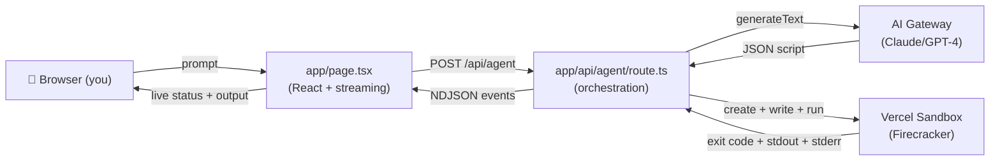
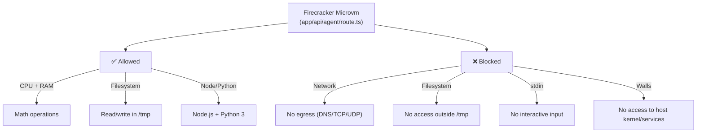
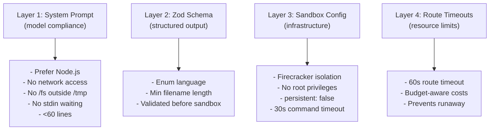

# sandbox-agent-demo

A focused demo of the **Vercel AI SDK** and **Sandbox**: describe a coding task, the model generates a self-contained script (Node.js or Python), and it runs isolated in a Firecracker microVM instead of on the request-handling server. Progress and output stream back to the browser as events.

**Free tier compatible** — works with zero-cost AI Gateway models. No billing required to try it.

Showcases:
- **AI SDK** code generation with free tier models via manual JSON parsing
- **Sandbox** infrastructure-level isolation and lifecycle management
- **Streaming events** with a custom NDJSON protocol (not SSE/useChat)
- **Production thinking** (cost awareness, tight timeouts, security model)

Built as a companion to [`trustclaw-jfrog-demo`](https://github.com/vhr1975/trustclaw-jfrog-demo) — same "generate → execute → report" pattern on different infrastructure.

## How It Works

A complete flow in under 60 seconds:

1. **You write a prompt** in the browser (e.g., "Generate 1000 random numbers and find the mean")
2. **Model generates code** — `generateText` with AI Gateway (free tier)
3. **Response parsed** — extract `{language, filename, code, summary}` from JSON
4. **Sandbox spins up** — Vercel launches a Firecracker microVM
5. **Script is written** → runs → output captured
6. **Results stream back** as NDJSON events (status → code → result → done)
7. **Browser renders** each event as it arrives

The entire flow is observable in your browser console. See `app/page.tsx` lines 47–65 for the event-parsing logic.

## Architecture Diagram



## Event Streaming (NDJSON)


## Isolation Model

What the sandbox **allows** vs. **blocks**:



## Why Manual JSON Parsing (Not generateObject)

`generateObject` requires expensive structured-output models (GPT-4, Claude Opus). Since this demo runs on the **free tier**, we use `generateText` instead and parse the JSON manually:

- **Model** generates plain JSON via system prompt
- **Route** parses with `JSON.parse()`, validates with Zod
- **Trade-off**: Simpler mental model (one code path), works on free tier — but requires trusting the model to return valid JSON (it usually does; errors are caught and streamed back as error events)

## Setup

**Prerequisites:** Node 20+, npm. Sign up for a free Vercel account (https://vercel.com).

```bash
npm install
cp .env.example .env.local
```

**Get your free AI Gateway key:**
1. Go to https://vercel.com/dashboard/ai-gateway
2. Click **Create Token** (or use an existing one)
3. Copy the token and set it in `.env.local`:
   ```bash
   AI_GATEWAY_API_KEY=<your_token>
   ```
4. No credit card needed for free tier (rate-limited to 10 requests/day)

**For Sandbox auth locally:**
```bash
vercel link       # Link your repo to a Vercel project (one-time)
vercel env pull   # Pull dev OIDC token into .env.local (expires in 12 hours)
npm run dev       # Start the dev server
```

The OIDC token is temporary; if it expires, re-run `vercel env pull`. On production Vercel, the SDK authenticates automatically via OIDC.

## Deploying

```bash
vercel deploy
```

Then set `AI_GATEWAY_API_KEY` in your Vercel project environment variables:
1. Go to https://vercel.com/dashboard/projects/vercel-agent-demo
2. Settings → Environment Variables
3. Add `AI_GATEWAY_API_KEY` (same token from Setup)
4. Redeploy

No Sandbox-specific env vars needed — the SDK authenticates via OIDC automatically.

**Cost Estimate:**
- **Free tier:** $0 (10 requests/day limit on AI Gateway)
- **100 runs/month:** ~$1–3 total (AI Gateway ~$0.01/run + Sandbox ~$0.01–0.05/run)
- **Hobby plan minimum:** $5/month (includes higher AI Gateway quota and Sandbox alloc)
- **Pro plan:** $20/month

See https://vercel.com/pricing for Sandbox and AI Gateway pricing details.

## Security & Guardrails

**Four-layer constraint model:**



**Rough edges & trade-offs:**
- System prompt guardrails are **soft**—model compliance, not infrastructure walls. Production use with untrusted input should add egress-blocking network policies (see Sandbox docs).
- Free tier AI Gateway has **10 requests/day limit** — perfect for demo, scaling requires Hobby+ plan.
- No **tool-calling loop**—model gets one shot; non-zero exit codes aren't retried.

See `FRICTION_LOG.md` for rough edges in the SDKs.

## Testing

**Unit + Integration** (vitest, mocked Sandbox/AI):
```bash
npm test
```
22 tests covering schema validation, event streaming, error handling, sandbox cleanup.

**E2E** (Playwright, real app):
```bash
npm run dev  # in one terminal
npm run test:e2e  # in another
```
Spins up the dev server and verifies the full flow end-to-end.

**All tests**:
```bash
npm run test:all
```
Runs lint → build → unit/integration → E2E.

See `docs/TESTING.md` for the full test strategy.

## What's Intentionally Left Out

- **Persistence** — Runs are ephemeral; nothing is logged. Production should track request → model → sandbox → result.
- **Auth/Rate Limiting** — `/api/agent` accepts any request. Add before sharing publicly.
- **Self-Correction** — Model gets one shot. Next step: on non-zero exit, feed stderr back and retry.
- **Error Catalog** — Generic error messages. See `docs/ERROR_HANDLING.md` for a deeper taxonomy.
- **Request Validation** — No size limits on prompt or generated code. Add before untrusted input.

## Documentation

- **CLAUDE.md** — Project philosophy and architecture decisions
- **FRICTION_LOG.md** — Real rough edges hit during dev (React 19, Sandbox v2 mental models, SDK inconsistencies)
- **docs/DEMO.md** — How to demo this to audiences (with sample prompts, talking points, interview code-review order)
- **docs/TESTING.md** — Full testing strategy (unit, integration, E2E, before-deploy checklist)
- **docs/ERROR_HANDLING.md** — What can go wrong and why
