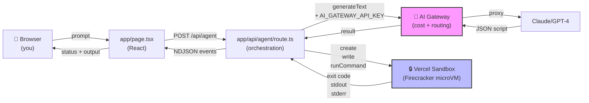
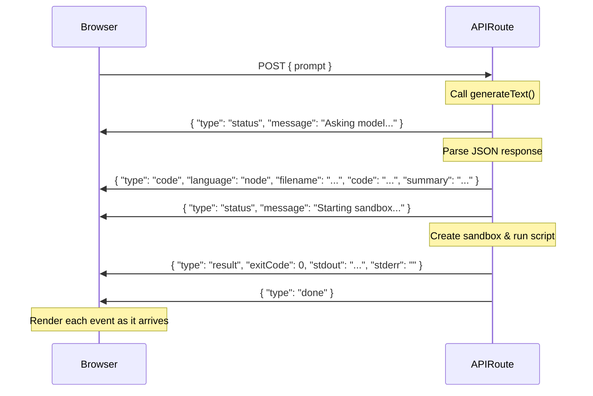
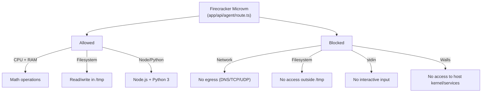
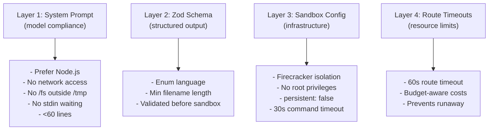

# sandbox-agent-demo

**The worked example that didn't exist.**

There's no canonical example showing AI SDK output feeding directly into Sandbox execution. This is that example — built, tested, documented, and shipped with a friction log.

A developer describes a coding task → AI SDK generates a self-contained script → Sandbox executes it isolated in a Firecracker microVM → results stream back to the browser.

**Who this is for:**
- Developers who've used AI SDK or Sandbox separately and want to see them connected
- Educators/DevRel building curriculum around agentic infrastructure
- Engineers building on Vercel's AI stack

**What you'll find:**
- A worked end-to-end example (not a tutorial, not a reference architecture — a real app)
- Honest guardrails and limitations (what works, what doesn't, why)
- A friction log (the rough edges I hit so you don't have to re-hit them)
- Tests at every layer (unit, integration, E2E) so you can fork and iterate
- Clear deployment path, cost breakdown, and security model

Built as a companion to [`trustclaw-jfrog-demo`](https://github.com/vhr1975/trustclaw-jfrog-demo) — different infrastructure, same "generate → execute → report" pattern.

## How It Works (Walkthrough)

Step-by-step, with real code references:

1. **You write a prompt** in the browser (e.g., "Generate 1000 random numbers and find the mean")
2. **`app/page.tsx`** → POSTs to `/api/agent`
3. **`app/api/agent/route.ts`** → calls `generateText()` via AI Gateway
   - System prompt asks for JSON: `{"language":"node"|"python","filename":"...","code":"...","summary":"..."}`
   - Model returns plain text; route parses with `JSON.parse()` and validates with Zod
   - **Why manual parsing instead of `generateObject`?** Structured output is expensive; free tier models only do plain text
4. **Sandbox is created** — `Sandbox.create({ runtime: "node24", timeout: 30_000, persistent: false })`
   - `persistent: false` because each run is one-off (this was friction log entry #1)
5. **Script is written** to the sandbox's `/tmp`, executed via `runCommand()`
6. **Output is captured** — exitCode, stdout, stderr
7. **Results stream back** as NDJSON events (status → code → result → done)
8. **`app/page.tsx` parses events** (lines 47–65) and renders them live

**Observable in your browser console** — every event is logged as it arrives. This is the feedback loop you need when building agents.

## Architecture Diagram



**Key components:**
- **AI Gateway** (magenta): Unified LLM API endpoint — handles auth, routing, cost tracking
- **Sandbox** (blue): Isolated microVM for executing untrusted scripts

## Event Streaming (NDJSON)



## Isolation Model

What the sandbox **allows** vs. **blocks**:



## The Two Critical Vercel Pieces

### 1. AI Gateway: Why Route Through It?

**What it is:** A unified API proxy that sits between your app and model providers (Claude, GPT-4, etc.).

**Why use it instead of calling Claude/OpenAI directly:**
- **Cost optimization** — batches requests, handles retries, picks cheapest models per task
- **Rate limiting & quotas** — free tier (10 requests/day), scales to Hobby/Pro
- **Unified token management** — one `AI_GATEWAY_API_KEY` works across providers
- **Model routing** — can swap models without code changes (`AI_MODEL` env var)
- **Observability** — logs all requests in Vercel dashboard for cost tracking

**How this app uses it:**
- Route calls `generateText({ model: process.env.AI_MODEL ?? "inclusionai/ling-3.0-flash-free" })`
- The token in `.env.local` / production env vars is the gateway key
- All LLM calls flow through AI Gateway, not directly to Claude/OpenAI APIs

### 2. Sandbox: Why Isolate Script Execution?

**The problem it solves:**
Without the Sandbox, running arbitrary user-generated code would execute **on your server**:
```
User prompt → Model generates script → script runs on your Node.js process
```
Risk: Malicious prompt → malicious script → compromised server (network access, env var theft, filesystem damage).

**The Sandbox solution:**
```
User prompt → Model generates script → script runs in isolated Firecracker microVM
```

**Why that matters:**
- **Resource isolation** — runaway script (infinite loop) is contained; can't crash the main server
- **Filesystem isolation** — generated script can't read `/etc/passwd` or your source code
- **Network isolation** — script can't reach internal services, steal API keys, or exfil data
- **Lifecycle management** — Vercel automatically provisions and tears down the microVM (no cleanup overhead)

**How this app uses it:**
- `app/api/agent/route.ts` line 80–84: `Sandbox.create({ runtime: "node24", timeout: 30_000, persistent: false })`
- Writes the generated script to the sandbox's `/tmp`
- Runs it: `sandbox.runCommand({ cmd: "node", args: ["script.js"] })`
- Captures stdout/stderr and kills the VM when done

This is the key difference from trustclaw: trustclaw runs code on a separate serverless function (isolation via request boundary); sandbox runs it in a true microVM (Firecracker), which is stronger isolation.

## Design Choice: Manual JSON Parsing (Not generateObject)

This example uses `generateText` + manual `JSON.parse()` instead of `generateObject`. Why that matters for learning:

**`generateObject` (the "right" way for production):**
- Requires expensive models (GPT-4, Claude Opus, etc.)
- Guarantees schema compliance at generation time
- Better for production systems that can't afford parsing failures

**Manual parsing (this example):**
- Works with free-tier models (Claude 3.5 Haiku, etc.)
- Shows you what schema validation looks like (Zod checks the parsed JSON)
- Teaches error handling — if the model returns invalid JSON, you see it (error event is streamed back)
- **The trade-off:** You're trusting the model's system prompt; in production, you'd use structured output

**Why this approach is better for a worked example:**
- Everyone can run it without hitting a paywall
- You see the full error path (parsing failures, validation errors) — which is the part the docs usually skip
- It's honest about the frontier: "LLM outputs aren't always perfect, here's how you handle that"

## Setup

**Prerequisites:** Node 20+, npm. Sign up for a free Vercel account (https://vercel.com).

```bash
npm install
cp .env.example .env.local
```

**Get your free AI Gateway key:**
1. Go to https://vercel.com/dashboard/ai-gateway
2. Click **Create Token** (or use an existing one)
3. Copy the token and set it in `.env.local`:
   ```bash
   AI_GATEWAY_API_KEY=<your_token>
   ```
4. No credit card needed for free tier (rate-limited to 10 requests/day)

**For Sandbox auth locally:**
```bash
vercel link       # Link your repo to a Vercel project (one-time)
vercel env pull   # Pull dev OIDC token into .env.local (expires in 12 hours)
npm run dev       # Start the dev server
```

The OIDC token is temporary; if it expires, re-run `vercel env pull`. On production Vercel, the SDK authenticates automatically via OIDC.

## Deploying

```bash
vercel deploy
```

Then set `AI_GATEWAY_API_KEY` in your Vercel project environment variables:
1. Go to https://vercel.com/dashboard/projects/vercel-agent-demo
2. Settings → Environment Variables
3. Add `AI_GATEWAY_API_KEY` (same token from Setup)
4. Redeploy

No Sandbox-specific env vars needed — the SDK authenticates via OIDC automatically.

**Cost Estimate:**
- **Free tier:** $0 (10 requests/day limit on AI Gateway)
- **100 runs/month:** ~$1–3 total (AI Gateway ~$0.01/run + Sandbox ~$0.01–0.05/run)
- **Hobby plan minimum:** $5/month (includes higher AI Gateway quota and Sandbox alloc)
- **Pro plan:** $20/month

See https://vercel.com/pricing for Sandbox and AI Gateway pricing details.

## Security & Guardrails

**Four-layer constraint model:**



**Rough edges & trade-offs:**
- System prompt guardrails are **soft**—model compliance, not infrastructure walls. Production use with untrusted input should add egress-blocking network policies (see Sandbox docs).
- Free tier AI Gateway has **10 requests/day limit** — perfect for demo, scaling requires Hobby+ plan.
- No **tool-calling loop**—model gets one shot; non-zero exit codes aren't retried.

See `FRICTION_LOG.md` for rough edges in the SDKs.

## Testing

**Unit + Integration** (vitest, mocked Sandbox/AI):
```bash
npm test
```
22 tests covering schema validation, event streaming, error handling, sandbox cleanup.

**E2E** (Playwright, real app):
```bash
npm run dev  # in one terminal
npm run test:e2e  # in another
```
Spins up the dev server and verifies the full flow end-to-end.

**All tests**:
```bash
npm run test:all
```
Runs lint → build → unit/integration → E2E.

See `docs/TESTING.md` for the full test strategy.

## What's Intentionally Left Out

- **Persistence** — Runs are ephemeral; nothing is logged. Production should track request → model → sandbox → result.
- **Auth/Rate Limiting** — `/api/agent` accepts any request. Add before sharing publicly.
- **Self-Correction** — Model gets one shot. Next step: on non-zero exit, feed stderr back and retry.
- **Error Catalog** — Generic error messages. See `docs/ERROR_HANDLING.md` for a deeper taxonomy.
- **Request Validation** — No size limits on prompt or generated code. Add before untrusted input.

## Documentation

- **CLAUDE.md** — Project philosophy and architecture decisions
- **FRICTION_LOG.md** — Real rough edges hit during dev (React 19, Sandbox v2 mental models, SDK inconsistencies)
- **docs/DEMO.md** — How to demo this to audiences (with sample prompts, talking points, interview code-review order)
- **docs/TESTING.md** — Full testing strategy (unit, integration, E2E, before-deploy checklist)
- **docs/ERROR_HANDLING.md** — What can go wrong and why
